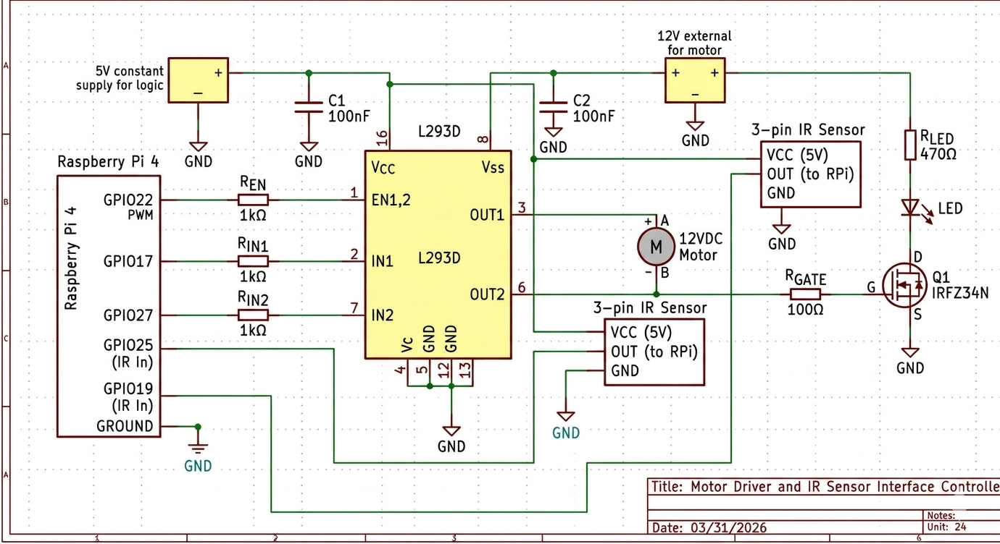

<center> <h1>Phone App RP4 Motor Control (PARMCO) 🚁⚙️</h1> </center>
<p align="center">
  
</p>

**PARMCO** is a full-stack embedded engineering project bridging mobile application development with low-level C hardware control. A Raspberry Pi 4 runs a C/ARM Assembly backend that drives a 12V DC motor via an L293D H-Bridge, while a Kotlin Android app connects over Bluetooth RFCOMM to provide wireless control and live RPM telemetry.

The system supports three operating modes: **Manual** (open-loop PWM control), **Maintain** (closed-loop speed hold using an adaptive proportional controller written in ARM assembly), and **Synced** (automatic target-matching to an external motor's RPM via a second IR sensor).

---

## 🚀 System Overview

The system architecture consists of a real-time C control server running on the Raspberry Pi and a Kotlin-based Android application. The two communicate via the **Bluetooth Serial Port Profile (SPP)**.

### Key Features
* **Low-Latency Control:** Non-blocking RFCOMM server using `select()` so incoming commands never stall the motor control loop.
* **Precision PWM:** Hardware-level Pulse Width Modulation via BCM2835 Channel 0 for smooth speed control (0–1000 range).
* **Closed-Loop Feedback:** An adaptive proportional controller in ARM assembly dynamically adjusts PWM to hold a target RPM, with gain scheduling based on error magnitude.
* **Live Telemetry:** IR sensor edge-detection with ~100 µs polling intervals, transmitting measured and external RPM to the app once per second.
* **Safety Integration:** Automatic motor shutdown and state reset on Bluetooth disconnection.

---

## 📁 Project Structure

The project is organized into two primary functional layers, each with its own README containing detailed setup and build instructions.

| Component | Primary Files | Responsibility |
| :--- | :--- | :--- |
| **Motor Control (C/ASM)** | `bt_motor_control.c`, `feedback.S`, `bluetooth-agent.service` | GPIO management, hardware PWM, IR polling, adaptive feedback control, and Bluetooth server logic. |
| **Mobile App (Kotlin)** | `MainActivity.kt`, `activity_main.xml` | Bluetooth client lifecycle, UI event handling, command dispatch, and telemetry visualization. |
| **Documentation** | `motor-control/README.md`, `android-app/README.md` | Subsystem-specific architecture, build instructions, and known limitations. |

---

## 🔌 Hardware Configuration

The system relies on a Raspberry Pi 4 connected to an L293D H-Bridge motor driver and IR optical encoder sensors. For detailed wiring, refer to the hardware schematic.



### BCM GPIO Mapping
* **Pin 18:** PWM Speed Control (Hardware PWM Channel 0, Alt5)
* **Pin 23 & 24:** H-Bridge Directional Logic (DIR1 / DIR2)
* **Pin 25:** IR Encoder Input (controlled motor)
* **Pin 19:** IR Encoder Input (external motor, used in Synced mode)

---

## 📡 Communication Protocol

Data is exchanged as newline-delimited ASCII strings (`\n`) over Bluetooth RFCOMM (SPP UUID `00001101-0000-1000-8000-00805F9B34FB`).

### App → Pi (Commands)
* `STATE:START` / `STATE:STOP` — Motor power toggle.
* `DIR:FORWARD` / `DIR:REVERSE` — H-Bridge polarity switch.
* `MODE:MANUAL` / `MODE:MAINTAIN` / `MODE:SYNCED` — Operating mode selection.
* `PWM:<0–1000>` — Sets PWM duty cycle directly (Manual mode only).
* `TARGET_RPM:<value>` — Sets desired RPM for the feedback controller (Maintain mode).

### Pi → App (Telemetry)
* `MEASURED_RPM:<value>` — Controlled motor speed from IR tachometer, sent every second.
* `EXTERNAL_RPM:<value>` — External motor speed from second IR sensor, sent every second.

---

## 🛠️ Quick Start

1.  **Prepare the Pi:** Install the `bcm2835` library, `libbluetooth-dev`, and `bluez-tools` packages.
2.  **Compile & Run:**
    ```bash
    as -o feedback.o feedback.S
    gcc -o bt_motor_control bt_motor_control.c feedback.o -lbcm2835 -lbluetooth
    sudo ./bt_motor_control
    ```
3.  **Enable Headless Bluetooth Pairing:**
    ```bash
    sudo cp bluetooth-agent.service /etc/systemd/system/
    sudo systemctl enable --now bluetooth-agent.service
    ```
4.  **Mobile Setup:** Build the Android project in Android Studio and deploy to a physical device.
5.  **Connect:** Open the app, tap "Connect to Pi", and select your Raspberry Pi from the device list.

---

> [!IMPORTANT]
> The Pi-side binary must run with `sudo` privileges to access hardware registers via `/dev/mem` and bind the Bluetooth RFCOMM socket. See the subfolder READMEs for detailed build requirements and known limitations.